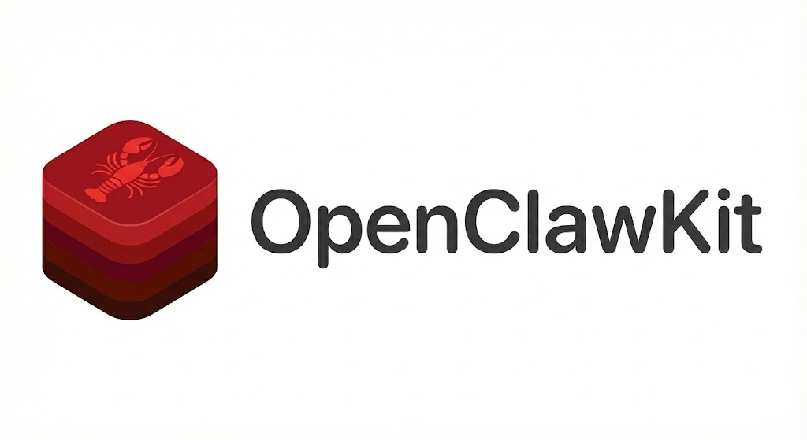

<p align="center">
  
</p>

# OpenClawKit

[](https://github.com/MarcoDotIO/OpenClawKit/actions/workflows/ci.yml)
[](https://github.com/MarcoDotIO/OpenClawKit/actions/workflows/security.yml)
[](https://github.com/MarcoDotIO/OpenClawKit/actions/workflows/release.yml)
[](LICENSE)

OpenClawKit is a Swift-native SDK for building local-first AI agents in Apple apps and Linux services.  
It ships actor-safe runtime primitives, channel adapters, model routing, skill execution, and a ready-to-run iOS example app.

## Highlights

- Swift 6.2 concurrency-first architecture (`actor`, `Sendable`, async APIs)
- Modular SDK surface (`OpenClawProtocol` through `OpenClawKit`) with clear layering
- Built-in model providers: OpenAI, OpenAI-compatible, Anthropic, Gemini, Foundation Models, local, and echo
- Channel runtime with Discord, Telegram, WhatsApp Cloud, and local webchat adapter flow
- Workspace skills system (`SKILL.md` + script entrypoints) with generic runtime invocation
- Runtime streaming + typing heartbeat support for long-running channel replies
- Secure credential and audit tooling (`CredentialStore`, `SecurityAuditRunner`) for safer app integrations
- Centralized diagnostics/usage pipeline with runtime + channel telemetry snapshots
- Strong test and CI posture: Swift Testing unit/E2E suites, Linux validation, iOS build gates, security scans

## Table of Contents

- [Overview](#overview)
- [Installation](#installation)
- [Quick Start](#quick-start)
- [Skills and Tooling](#skills-and-tooling)
- [Observability and Usage Metrics](#observability-and-usage-metrics)
- [Security and Throttling](#security-and-throttling)
- [iOS Example App](#ios-example-app)
- [Package Modules](#package-modules)
- [Testing and Quality Gates](#testing-and-quality-gates)
- [Documentation](#documentation)
- [Contributing](#contributing)
- [License](#license)

## Overview

OpenClawKit is designed for teams that want to ship agent experiences without building a full runtime stack from scratch.  
You can compose model routing, session persistence, memory context, channel ingress/egress, and skill execution in one Swift package.

Who this is for:

- Swift engineers building agent-enabled iOS/macOS/tvOS/watchOS apps
- Backend teams running Linux-hosted Swift services with local or hosted model backends
- OSS contributors who want clean module boundaries and predictable extension points

## Installation

Add OpenClawKit in Swift Package Manager.

```swift
dependencies: [
    .package(url: "https://github.com/MarcoDotIO/OpenClawKit.git", branch: "main")
]
```

Then add the product to your target:

```swift
targets: [
    .target(
        name: "MyApp",
        dependencies: [
            .product(name: "OpenClawKit", package: "OpenClawKit")
        ]
    )
]
```

### Minimum toolchain

- Swift tools: `6.2`
- Apple platforms: iOS 17+, macOS 14+, tvOS 17+, watchOS 10+
- Linux: supported with compatibility shims (including `FoundationNetworking` where needed)

## Quick Start

```swift
import OpenClawKit

let sdk = OpenClawSDK.shared
let config = OpenClawConfig()
let sessionsURL = URL(fileURLWithPath: "./state/sessions.json")
let diagnostics = sdk.makeDiagnosticsPipeline(eventLimit: 300)

let outbound = try await sdk.getReplyFromConfig(
    config: config,
    sessionStoreURL: sessionsURL,
    inbound: InboundMessage(channel: .webchat, peerID: "user-1", text: "Hello there"),
    diagnosticsPipeline: diagnostics
)

print(outbound.text)
print(await diagnostics.usageSnapshot().runsCompleted)
```

This flow gives you:

- session key resolution + persistence
- auto-reply routing through the embedded runtime
- model response generation with configured provider routing

## Skills and Tooling

OpenClawKit supports workspace skills from `skills/<name>/SKILL.md` with script entrypoints.

For the bundled iOS example app, starter skills are project-owned in:

- `Examples/iOS/OpenClawiOS/skills/<name>/SKILL.md`
- Deploy flow syncs these into the app workspace before runtime start.

- Explicit invocation:
  - `/skill weather {"location":"San Diego"}`
  - `/weather {"location":"San Diego"}`
- Natural-language references to skill names are also resolved in runtime auto-reply flow.
- Skill execution is runtime-owned (SDK layer), not app-owned.

Sample weather skill:

- Definition: `Examples/iOS/OpenClawiOS/skills/weather/SKILL.md`
- Entrypoint: `Examples/iOS/OpenClawiOS/skills/weather/scripts/weather.js`

## Observability and Usage Metrics

OpenClawKit includes a centralized telemetry actor:

- `RuntimeDiagnosticsPipeline` for retaining recent diagnostics events
- `usageSnapshot()` for aggregate run/model/skill/channel counters and latency totals
- `recentEvents(limit:)` for timeline-driven app UX

Runtime and auto-reply flows emit stable diagnostics names (`run.started`,
`model.call.completed`, `skill.invoked`, `outbound.sent`, `outbound.failed`, etc.)
that can be consumed directly by host apps.

## Security and Throttling

OpenClawKit includes lightweight hardening helpers:

- `CredentialStore` abstraction for secure secret persistence (Keychain on Apple platforms).
- `OpenClawSDK.runSecurityAudit(...)` for risky-default, plaintext-secret, and permissions checks.
- `ChannelSendThrottlePolicy` for per-channel outbound throttling.
- `ModelProviderThrottlePolicy` for per-provider request throttling and fallback-aware control.

## iOS Example App

A complete iOS sample app is included:

- Project: `Examples/iOS/OpenClawiOS`
- Deploy tab: credentials, routing, personality, deployment lifecycle
- Chat tab: transcript UX with runtime-backed responses and memory summarization
- Models tab: provider switching + local runtime tuning controls
- Skills tab: discovered skills + invocation policy/status visibility
- Channels tab: route map preview + live channel health snapshots
- Diagnostics tab: usage counters + recent runtime/channel event timeline

Build locally:

```bash
./Scripts/build-ios-example.sh
```

## Package Modules

- `OpenClawProtocol` - generated protocol models and gateway frame types
- `OpenClawCore` - config/session stores, cross-platform shims, hooks/cron/security helpers, diagnostics pipeline
- `OpenClawGateway` - actor-isolated gateway transport and socket lifecycle
- `OpenClawModels` - provider protocols, routing, and provider implementations
- `OpenClawSkills` - skill discovery, prompt snapshots, and runtime invocation engine
- `OpenClawAgents` - embedded runtime, tool orchestration, timeout-safe run lifecycle
- `OpenClawPlugins` - plugin protocol surfaces, services, and custom method hooks
- `OpenClawChannels` - channel adapters and auto-reply orchestration
- `OpenClawMemory` - conversation memory store and memory indexing/search primitives
- `OpenClawMedia` - media normalization and MIME classification helpers
- `OpenClawKit` - top-level facade APIs with module re-exports

## Testing and Quality Gates

Run core validation locally:

```bash
swift build
Scripts/check-networking-concurrency.sh
swift test
./Scripts/build-ios-example.sh
```

CI workflows:

- `ci.yml` - Swift validation + iOS example build
- `security.yml` - secret scanning
- `release.yml` - changelog-gated tag releases

## Documentation

- [Architecture](docs/architecture.md)
- [Testing Guide](docs/testing.md)
- [API Surface](docs/api-surface.md)
- [Changelog](CHANGELOG.md)

Protocol models are generated from schema:

```bash
node Scripts/protocol-gen-swift.mjs
```

## Contributing

Issues and PRs are welcome.

- Bugs and feature requests: [GitHub Issues](https://github.com/MarcoDotIO/OpenClawKit/issues)
- Changes and review: [Pull Requests](https://github.com/MarcoDotIO/OpenClawKit/pulls)

If you are contributing runtime or networking changes, please include tests and run the validation sequence above before opening a PR.

## Acknowledgements

OpenClawKit is a Swift-native SDK aligned with the broader OpenClaw ecosystem design and practices.

Upstream project inspiration:

- https://github.com/openclaw/openclaw

## License

OpenClawKit is released under the MIT License. See [LICENSE](LICENSE).

